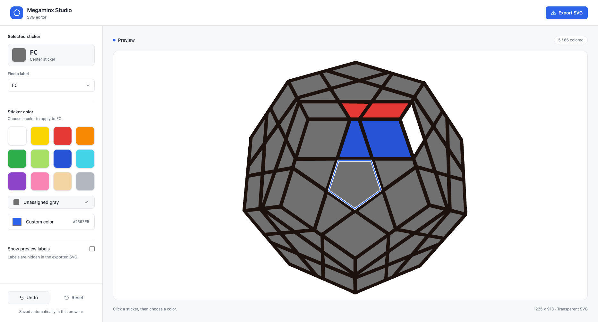

# Megaminx Studio

Megaminx SVG image editor built with React, Vite, Tailwind CSS, and shadcn/ui. No backend or account is required.

## Feature

Open the local URL printed by Vite. Select a sticker in the preview or search its label, then choose a preset or custom color. The editor saves colors in browser storage. Undo keeps the last 100 changes, including resets.

Export downloads `megaminx.svg` with a transparent background at 1225 × 913. Preview labels and selection outlines are excluded.



The original SVGs are kept at the project root. `src/geometry.json` contains their shared polygon geometry and label positions. The image shows 66 stickers across the six visible faces of a Megaminx.

## Development

### Run locally

```sh
bun install --frozen-lockfile
bun run dev
```

### Deployment

```sh
bun test
bun run build
bun run preview
```
